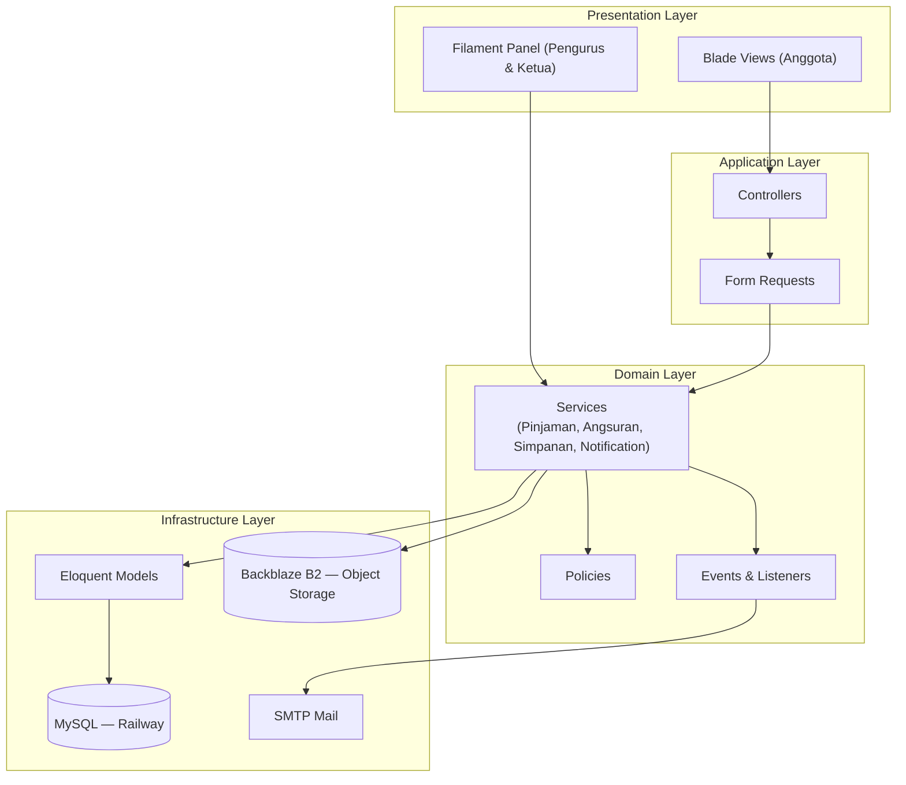
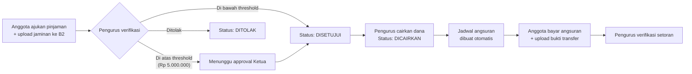

# Koperasi Simpan Pinjam

**Koperasi Sejahtera Bersama Akhsan** — aplikasi web manajemen koperasi simpan pinjam berbasis **Laravel 12**, dengan alur pengajuan pinjaman berjenjang, manajemen simpanan anggota, notifikasi otomatis, proses terjadwal, serta arsitektur berlapis (layered architecture) yang siap dideploy ke cloud.


---

## Daftar Isi

1. [Tentang Aplikasi](#tentang-aplikasi)
2. [Fitur Utama](#fitur-utama)
3. [Role & Hak Akses](#role--hak-akses)
4. [Arsitektur](#arsitektur)
5. [Alur Bisnis: Pengajuan Pinjaman](#alur-bisnis-pengajuan-pinjaman)
6. [Teknologi yang Digunakan](#teknologi-yang-digunakan)
7. [Struktur Proyek](#struktur-proyek)
8. [Persyaratan Sistem](#persyaratan-sistem)
9. [Instalasi & Menjalankan Secara Lokal](#instalasi--menjalankan-secara-lokal)
10. [Konfigurasi Object Storage (Backblaze B2)](#konfigurasi-object-storage-backblaze-b2)
11. [Akun Demo](#akun-demo)
12. [Menjalankan Test](#menjalankan-test)
13. [Deployment (Railway)](#deployment-railway)
14. [Dokumentasi UML](#dokumentasi-uml)
15. [Lisensi](#lisensi)

---

## Tentang Aplikasi

**Koperasi Simpan Pinjam** adalah sistem informasi yang mendigitalisasi proses simpan pinjam koperasi, mencakup:

- Pencatatan simpanan anggota (pokok, wajib, sukarela)
- Pengajuan pinjaman dengan verifikasi dan persetujuan berjenjang sesuai nominal
- Pencairan dana dan pembuatan jadwal angsuran otomatis
- Pembayaran angsuran beserta perhitungan denda keterlambatan
- Notifikasi email otomatis di setiap perubahan status
- Proses terjadwal (scheduled job) harian untuk memantau angsuran yang jatuh tempo

Aplikasi memisahkan tiga peran pengguna (**Anggota**, **Pengurus**, **Ketua**) dengan hak akses dan antarmuka yang berbeda, serta menyimpan seluruh berkas unggahan (jaminan pinjaman dan bukti transfer) di *object storage* terpisah (Backblaze B2), bukan di disk server aplikasi.

## Fitur Utama

| Fitur | Deskripsi |
|---|---|
| **Role-Based Access Control** | 3 peran (Anggota, Pengurus, Ketua) dengan middleware & policy per aksi |
| **Manajemen Simpanan** | Setor/tarik simpanan sukarela, simpanan pokok & wajib bersifat tetap selama keanggotaan |
| **Pengajuan Pinjaman Berjenjang** | Verifikasi oleh Pengurus, lalu approval Ketua otomatis diminta bila nominal di atas threshold |
| **Perhitungan Bunga & Denda** | Bunga dihitung per tenor; denda keterlambatan angsuran dihitung otomatis harian |
| **Upload ke Object Storage** | Jaminan pinjaman & bukti transfer angsuran tersimpan di Backblaze B2 (S3-compatible), bukan disk lokal |
| **Notifikasi Email Otomatis** | Event/Listener mengirim email tiap kali status pinjaman/angsuran berubah |
| **Scheduled Job** | Command harian untuk menandai angsuran telat & menghitung denda |
| **Panel Admin (Filament)** | Pengurus & Ketua bekerja lewat panel admin, terpisah dari tampilan Anggota |
| **Automated Testing** | Test fitur untuk alur pengajuan pinjaman (PHPUnit) |

## Role & Hak Akses

| Role | Hak Akses | Antarmuka |
|---|---|---|
| **Anggota** | Ajukan pinjaman, bayar angsuran, setor/tarik simpanan sukarela | Halaman web (Blade) |
| **Pengurus** | Verifikasi pengajuan pinjaman, cairkan dana, verifikasi bukti pembayaran angsuran | Panel Admin Filament (`/admin`) |
| **Ketua** | Menyetujui pengajuan pinjaman dengan nominal di atas threshold | Panel Admin Filament (`/admin`) |

## Arsitektur

Aplikasi mengikuti arsitektur berlapis (*layered architecture*): Presentation → Application → Domain → Infrastructure, agar logika bisnis (Services) tidak bercampur dengan HTTP layer maupun akses data.



## Alur Bisnis: Pengajuan Pinjaman



Status pinjaman mengikuti alur: `DIAJUKAN → DIVERIFIKASI → DISETUJUI → DICAIRKAN` (atau `DITOLAK` di titik verifikasi/approval). Nominal pengajuan di atas **Rp 5.000.000** wajib mendapat persetujuan Ketua sebelum bisa dicairkan.

## Teknologi yang Digunakan

- **Backend:** Laravel 12 (PHP 8.2+)
- **Admin Panel:** Filament 3.3
- **Autentikasi:** Laravel Breeze
- **Database:** MySQL 8 (produksi, managed di Railway) / SQLite (development)
- **Object Storage:** Backblaze B2 (S3-compatible) via Laravel Filesystem (`s3` driver)
- **Frontend:** Blade, TailwindCSS, Alpine.js, Vite
- **Testing:** PHPUnit
- **Hosting/PaaS:** Railway (auto-deploy dari GitHub)

## Struktur Proyek

```
app/
├── Console/Commands/     # Scheduled job (cek jatuh tempo angsuran)
├── Events/               # Event perubahan status (Pinjaman, Angsuran)
├── Exceptions/           # Custom exception domain pinjaman
├── Filament/Resources/   # Panel admin untuk Pengurus & Ketua
├── Http/Controllers/     # Controller alur Anggota
├── Http/Middleware/      # Middleware pembatas akses per role
├── Listeners/            # Pengirim notifikasi otomatis
├── Mail/                 # Template email status update
├── Models/               # Anggota, Simpanan, Pinjaman, Angsuran, Notifikasi
├── Policies/             # Otorisasi berbasis role per aksi
└── Services/             # Business logic (PinjamanService, AngsuranService, dst.)

database/
├── migrations/           # Skema: anggota, simpanan, pinjaman, angsuran, notifikasi
└── seeders/              # Seeder akun demo 3 role

docs/uml/                 # Dokumentasi 7 diagram UML (use case, class, sequence, dst.)
routes/
├── web.php               # Route per role (Anggota / Pengurus / Ketua)
└── console.php           # Registrasi scheduled job
```

## Persyaratan Sistem

- PHP 8.2 atau lebih baru
- Composer
- Node.js & NPM
- MySQL 8 (atau SQLite untuk development)
- Akun [Backblaze B2](https://www.backblaze.com/cloud-storage) (wajib saat deploy produksi, opsional saat development)

## Instalasi & Menjalankan Secara Lokal

```bash
# 1. Clone repository
git clone https://github.com/<username>/koperasi-simpan-pinjam.git
cd koperasi-simpan-pinjam

# 2. Install dependency PHP & JS
composer install
npm install

# 3. Siapkan file environment
cp .env.example .env
php artisan key:generate

# 4. Setup database (paling cepat pakai SQLite untuk development)
touch database/database.sqlite
# lalu set di .env: DB_CONNECTION=sqlite

# 5. Jalankan migrasi + seeder (membuat akun demo 3 role)
php artisan migrate:fresh --seed

# 6. Buat symbolic link storage (untuk disk lokal saat development)
php artisan storage:link

# 7. Build asset frontend
npm run build
# atau untuk mode pengembangan dengan hot-reload:
npm run dev

# 8. Jalankan server
php artisan serve
```

Aplikasi dapat diakses di `http://127.0.0.1:8000`.

> Alternatif: jalankan `composer run dev` untuk menjalankan server, queue listener, log viewer, dan Vite sekaligus dalam satu perintah.

## Konfigurasi Object Storage (Backblaze B2)

Berkas jaminan pinjaman dan bukti transfer angsuran disimpan lewat disk `s3` (`config/filesystems.php`), yang di produksi diarahkan ke **Backblaze B2** karena kompatibel dengan S3 API.

**Langkah setup:**

1. Buat akun di [backblaze.com](https://www.backblaze.com/cloud-storage) → buat **Bucket** baru (disarankan *private*).
2. Buka **App Keys** → **Add a New Application Key** → batasi akses hanya ke bucket ini → catat `keyID` dan `applicationKey` (applicationKey hanya ditampilkan sekali, simpan segera).
3. Buka halaman detail bucket untuk melihat **Endpoint**-nya, formatnya `s3.<region>.backblazeb2.com` (misalnya `s3.us-west-004.backblazeb2.com`) — bagian `<region>` inilah yang dipakai di `AWS_DEFAULT_REGION`.
4. Isi variabel berikut di `.env` (development) atau di Environment Variables Railway (produksi):

```env
FILESYSTEM_DISK=s3

AWS_ACCESS_KEY_ID=isi_dengan_keyID_backblaze
AWS_SECRET_ACCESS_KEY=isi_dengan_applicationKey_backblaze
AWS_DEFAULT_REGION=us-west-004
AWS_BUCKET=nama_bucket_kamu
AWS_ENDPOINT=https://s3.us-west-004.backblazeb2.com
AWS_USE_PATH_STYLE_ENDPOINT=false
```

> Sesuaikan region dan endpoint dengan yang tertera di dashboard bucket Backblaze kamu sendiri — nilai di atas hanya contoh.

## Akun Demo

Tersedia lewat `DatabaseSeeder` untuk keperluan testing/presentasi:

| Role | Email | Password |
|---|---|---|
| Ketua | `ketua@koperasi.test` | `password` |
| Pengurus | `pengurus@koperasi.test` | `password` |
| Anggota | `anggota@koperasi.test` | `password` |

> Nonaktifkan atau ganti akun demo ini sebelum digunakan di lingkungan produksi sungguhan.

## Menjalankan Test

```bash
php artisan test
```

## Deployment (Railway)

Aplikasi ini di-deploy di **Railway** dengan dua service dalam satu project (environment `production`):

| Service | Fungsi |
|---|---|
| **MySQL** | Database utama, dengan volume `mysql-volume` untuk persistensi data |
| **koperasi-simpan-pinjam** | Service aplikasi Laravel, di-deploy langsung dari repository GitHub dan auto-deploy setiap ada push ke branch utama |

**Environment Variables** yang perlu diisi di tab *Variables* pada service aplikasi:

```env
APP_NAME="Koperasi Sejahtera Bersama Akhsan"
APP_ENV=production
APP_KEY=          # generate lokal, JANGAN pernah publikasikan nilainya: php artisan key:generate --show
APP_DEBUG=false
APP_URL=https://koperasi-simpan-pinjam-uas-production.up.railway.app

CACHE_STORE=file
SESSION_DRIVER=file
QUEUE_CONNECTION=sync

DB_CONNECTION=mysql
DB_HOST=${{MySQL.MYSQLHOST}}
DB_PORT=${{MySQL.MYSQLPORT}}
DB_DATABASE=${{MySQL.MYSQLDATABASE}}
DB_USERNAME=${{MySQL.MYSQLUSER}}
DB_PASSWORD=${{MySQL.MYSQLPASSWORD}}

FILESYSTEM_DISK=s3
AWS_ACCESS_KEY_ID=isi_dari_dashboard_backblaze   # JANGAN commit nilai asli ke Git
AWS_SECRET_ACCESS_KEY=isi_dari_dashboard_backblaze # JANGAN commit nilai asli ke Git
AWS_DEFAULT_REGION=us-west-004
AWS_BUCKET=koperasi-simpan-pinjam-uploads
AWS_ENDPOINT=https://s3.us-west-004.backblazeb2.com
AWS_USE_PATH_STYLE_ENDPOINT=true

MAIL_MAILER=smtp
MAIL_HOST=isi_smtp_provider
MAIL_PORT=587
MAIL_USERNAME=isi_dari_provider
MAIL_PASSWORD=isi_dari_provider
```

> **Penting — jangan pernah commit file `.env` asli atau nilai kredensial ke Git**, termasuk ke README ini. `APP_KEY`, `AWS_ACCESS_KEY_ID`, dan `AWS_SECRET_ACCESS_KEY` hanya diisi lewat dashboard Railway (tab **Variables**), tidak pernah dituliskan di kode maupun dokumentasi yang di-push ke GitHub.
>
> `DB_HOST`, `DB_PORT`, `DB_DATABASE`, `DB_USERNAME`, `DB_PASSWORD` di atas memakai sintaks *variable reference* Railway (`${{MySQL.MYSQLHOST}}` dst.) — ini aman ditulis apa adanya karena Railway yang mengganti nilainya secara internal, bukan kredensial mentah.
>
> Catatan: `APP_DEBUG` sebaiknya `false` di production (menampilkan detail error ke publik berisiko membocorkan informasi sensitif). Kalau saat ini masih `true` di Railway kamu, disarankan diubah setelah semua fitur stabil.

**Start Command** (Settings → Deploy → Custom Start Command):

```bash
php artisan migrate --force && php artisan serve --host=0.0.0.0 --port=$PORT
```

**Scheduled Job:** tambahkan Cron Job terpisah di Railway (New → Cron Job) dengan schedule `* * * * *` dan command:

```bash
php artisan schedule:run
```

Ini menjalankan `angsuran:cek-jatuh-tempo` sesuai jadwal harian yang didaftarkan di `routes/console.php`.


## Lisensi

Proyek ini dibuat untuk keperluan akademik (Tugas Akhir Semester - Cloud Computing)😁🥲.
